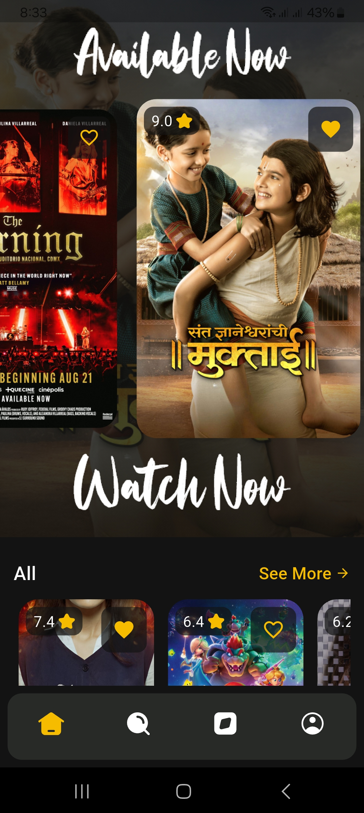
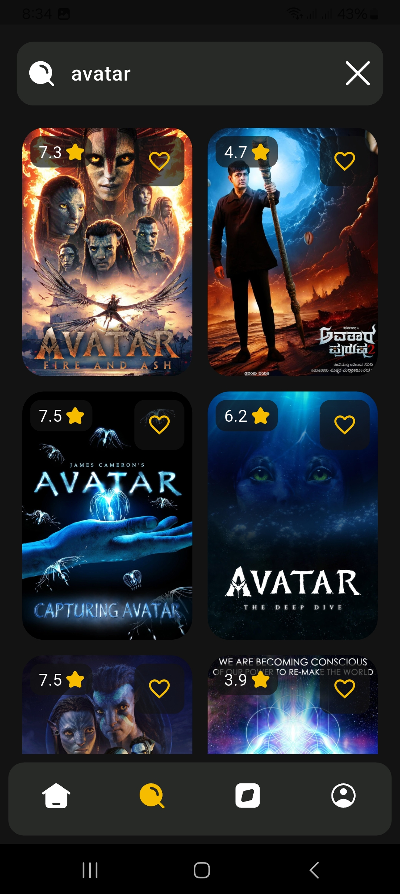
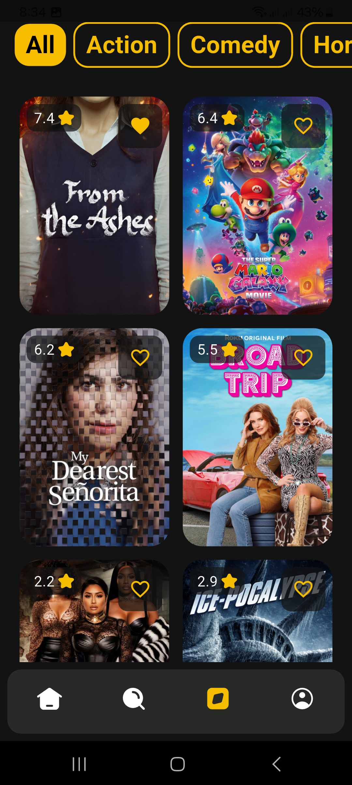
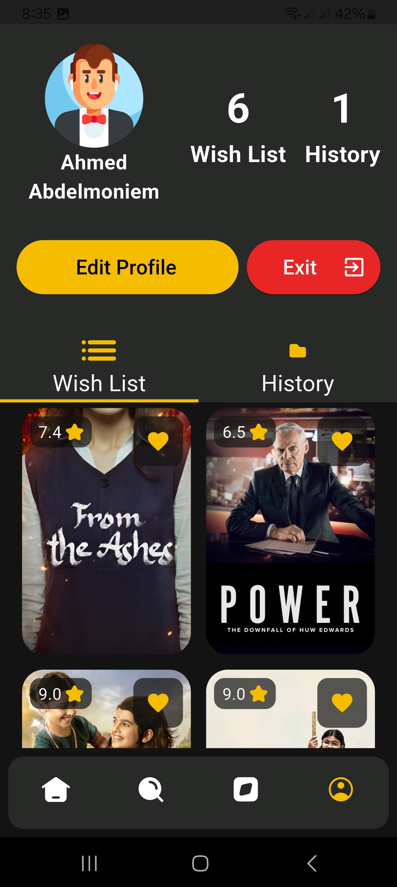
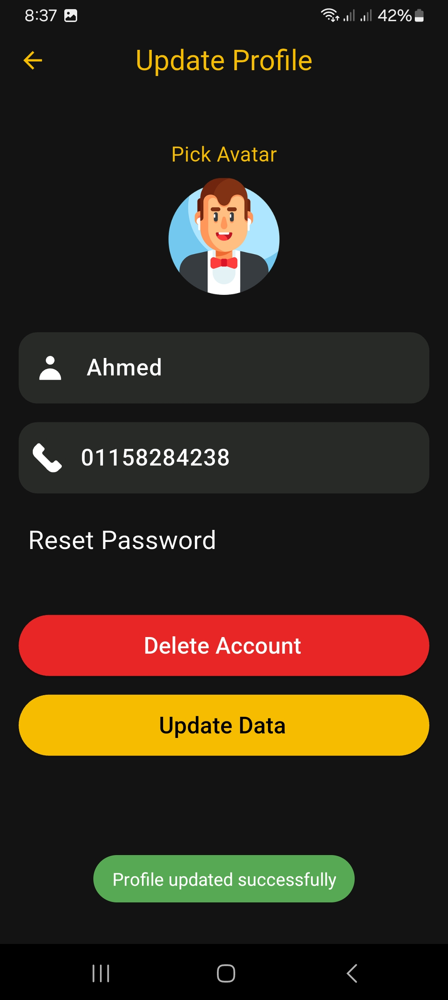
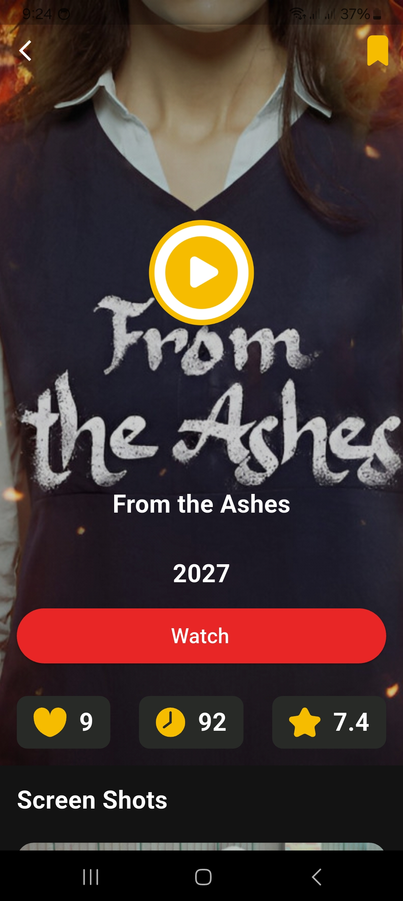

# 📰 Movies App

A modern Flutter application that allows users to explore movies, view details, manage favorites, and handle authentication using Firebase with a clean MVVM architecture.

---

## ✨ Features

🎬 Browse latest and popular movies
🔍 Search movies by name
❤️ Add/remove favorites
👤 User authentication (Email & Google Sign-In)
🔐 Reset password via email
🧾 Update user profile (name, phone, avatar)
🌐 Real-time data using Firebase Firestore
💾 Local caching using SharedPreferences
⚡ Smooth and responsive UI
🎨 Clean and modern UI design  

---

## 🧠 Architecture (MVVM)

This project follows MVVM (Model - View - ViewModel) architecture for scalability and clean separation of concerns.

- Model → Data structures (UserModel, MovieModel)
- View → UI screens
- ViewModel → Business logic using Bloc/Cubit

## 🧩 State Management & DI

- 🧠 flutter_bloc (Cubit/Bloc) for state management
- 🧩 get_it + injectable for dependency injection
- 🔄 Reactive UI updates based on state changes

---

### 🔥 Authentication Features

- Email & Password Login
- Google Sign-In
- Forgot Password (Email reset link)
- Delete Account (with password confirmation)
- Update Profile data  

## 📸 Screenshots








👉 More Screenshots:
<https://drive.google.com/drive/folders/1oGpCB7R4-AOT-HlUyremNFwZ3mbfXrBZ?usp=drive_link>

---

## 🎥 Demo Video

👉 Watch the app demo:
<https://drive.google.com/file/d/1CDSGZDWOiEZ9IQnMreZ1RLSH3B2bXunH/view?usp=drive_link>

---

## 📦 Download APK

👉 Get latest APK:
<https://drive.google.com/file/d/1Y4VL8XskU-Qi0Zpt2EIs79yMaiPmLSGk/view?usp=drive_link>

---

## 🛠️ Tech Stack

💙 Flutter
🎯 Dart
🔥 Firebase Auth
☁️ Cloud Firestore
🧠 Bloc (Cubit)
🧩 get_it / injectable
💾 SharedPreferences
🌐 Dio (API calls)
🎨 Flutter SVG
📱 ScreenUtil
🔗 URL Launcher

### 🔹 Architecture

- 🧱 **MVVM (Model - View - ViewModel)**  
- 🔄 Reactive UI with **Bloc/Cubit**  
- 🧩 Scalable structure using **Dependency Injection**

---

## 📁 Project Structure  

lib/
 ├── core/
 ├── features/
 │    ├── auth/
 │    ├── home/
 │    ├── profile/
 │    ├── movies/
 ├── main.dart

---

## ⚙️ Getting Started

1. Clone the repository:

```bash
git clone https://github.com/A7med22x/movies.git
```

1. Navigate to project folder:

```bash
cd movies
```

1. Install dependencies:

```bash
flutter pub get
```

1. Run the app:

```bash
flutter run
```

---

## 🎨 Assets

- Images: `assets/images/`
- Icons: `assets/icons/`

---

## 📱 App Icon & Splash

- Launcher icon configured via `flutter_launcher_icons`
- Splash screen via `flutter_native_splash`

---

## 👨‍💻 Author

Ahmed Abd El-Moniem

---

## 📄 License

This project is for educational purposes.
